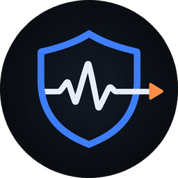

<p align="center">
  
</p>

# agentmon

检测 AI 编程 agent（Claude Code / Codex CLI / **ZCode** / Cursor / Gemini CLI / Qwen Code / iFlow …）
是否在读取你的本地代码、密钥，并向未授权的地址上传。

> 背景：2026-09 智谱 ZCode 被曝在登录状态下把整个仓库（含 `.git`）本地打包加密后静默上传，
> 用户无法关闭；官方说明称由「代码库索引」功能默认开启导致。agentmon 就是为这类行为设计的审计工具。

## 它检测什么

| 规则 | 说明 | 数据来源 |
|---|---|---|
| `exfil.chain` | **敏感/批量读取 → 短时间内出站上传**（ZCode 特征） | 文件审计 + 网络 |
| `fs.sensitive_read` | 读取 `.git`、`.env`、`id_rsa`、`*.pem`、`.aws/`、`.ssh/` | 文件审计（需 root） |
| `fs.bulk_read` | 60 秒内读取同一仓库 200+ 个文件 | 文件审计（需 root） |
| `egress.volume_spike` | 5 分钟窗口内出站超过 20MB | 按进程字节统计 |
| `egress.unknown_domain` | 连接白名单外的目标（按 agent 画像 + 全局白名单） | 连接采集 |
| `egress.sensitive_payload` | 请求体判定为源码/密钥；**发往遥测端点则直接 critical** | 本地 MITM |
| `artifact.hidden_blob` | 数据目录出现高熵大文件（本地打包/加密块） | 静态扫描 |
| `artifact.unexpected_endpoint` | 配置里出现白名单外的上传端点 | 静态扫描 |

## 三层监控

```
1. 元数据（无需特权）   进程归属 · 出站连接 · 按进程字节 · 静态痕迹
2. 内容（本地代理）     请求体分类：源码 / 密钥 / 压缩包 / base64 解包
3. 文件读取（需 root）  eslogger(macOS) / fanotify(Linux) / ETW(Windows 未实现)

> 平台验证状态：macOS 上三层都已实测通过；Linux 的元数据层、内容层、fanotify 文件层代码均已实现，但只做了协议解析层的单元测试，**未在真实 Linux 上跑过**；
> Windows 目前只有元数据层这一层。
```

内容层用 `agentmon wrap` 启动 agent 即可启用，**不需要修改系统信任设置**：

```bash
agentmon wrap -- claude          # 自动注入 HTTPS_PROXY 与 NODE_EXTRA_CA_CERTS 等
agentmon wrap -- codex
agentmon wrap --agent zcode -- /Applications/ZCode.app/Contents/MacOS/ZCode
```

它会创建本地 CA（`~/.config/agentmon/ca/`，0600），动态签发证书做 TLS 中间人，
对每个请求体做分类：先解开 gzip / base64 / 归档，再判断是不是源码、有没有密钥特征。
判定结果**只在本地**，命中密钥时只记录类型（如"AWS Access Key"），不落密钥原文。

`agentmon ca install` 会打印在三个平台把该 CA 加入系统信任的命令（需你自己执行）。

## 快速开始

```bash
cargo build --release

./target/release/agentmon doctor      # 先看本机各层能力现状

# 看看本机装了哪些 agent、数据目录多大
./target/release/agentmon agents

# 静态扫描：高熵打包块 + 配置里的可疑端点（无需特权）
./target/release/agentmon scan --deep

# 实时监控（前台，无需特权）
./target/release/agentmon watch

# 内容层：抓取并分类某个 agent 发出的请求
./target/release/agentmon wrap -- curl https://api.example.com

# 安装常驻守护进程（解锁文件读取审计，需 sudo）
sudo ./target/release/agentmon install --dry-run   # 先看要做什么
sudo ./target/release/agentmon install

# 查看结果
./target/release/agentmon findings
./target/release/agentmon report
./target/release/agentmon service-status
```

守护进程安装后会创建 `agentmon` 组并把当前用户加进去（GUI 靠它读取系统数据库），
数据落在 `/Library/Application Support/agentmon/`（Linux 为 `/var/lib/agentmon/`），
以 root 运行时 umask 为 027、目录 0750，其他本地用户读不到。

桌面端：

```bash
cd crates/app
pnpm install
pnpm tauri dev      # 开发模式（会自动起 Vite）
pnpm tauri build    # 打包 dmg / msi / AppImage
```

想在浏览器里调界面（不启动 Tauri）直接 `pnpm dev`：检测不到 Tauri 桥接时
界面会用 `src/mock.ts` 的样例数据渲染，方便调样式；打包出的应用永远走真实数据。
页面支持 hash 深链接，例如 `#findings`、`#content`。

> 注意：直接跑 debug 二进制（`cargo build -p agentmon-app`）会去加载
> `http://localhost:1420` 的开发服务器，窗口会空白；调试用 `pnpm tauri dev`，
> 独立运行用 `cargo build --release -p agentmon-app`（资源会嵌进二进制）。

## 数据与隐私

- 所有数据只落在本机 SQLite：`~/Library/Application Support/agentmon/agentmon.db`（root 模式下为 `/Library/Application Support/agentmon/`）。
- agentmon 自身**零遥测、不主动联网**，只有你显式配置的 webhook 会收到告警。
- 默认只记录元数据（主机、字节数、路径、哈希）。抓包内容默认只存哈希与分类结果，`capture.capture_bodies` 打开后才落原文。
- 默认保留 7 天（`retention_days`）。

## 配置

首次运行会生成 `~/.config/agentmon/config.yaml`（`agentmon config show` 查看）。
自定义 agent 画像放在 `~/.config/agentmon/profiles.d/*.yaml`，同 `id` 覆盖内置。

```yaml
id: my-agent
name: My Agent
vendor: Acme
process:
  names: [my-agent]
  cmdline_contains: ["my-agent"]
data_dirs: ["~/.my-agent"]
allowed_domains: ["*.acme.com"]
```

## 已知限制

- macOS 自研 Endpoint Security 客户端需要 Apple 特批 entitlement，因此这里用 Apple 自带的
  `eslogger` 子进程实现文件审计，解析逻辑对输出格式变化做了容错。
- 按进程字节数：macOS 精确（nettop，需 PTY）、Linux 近似（`ss` 计数）、Windows 待实现。
- 本机若使用 fake-ip 代理（Clash/Surge 等的 `198.18.0.0/15`），按 IP 无法解析真实域名，
  需要 `agentmon wrap` 走本地代理拿到真实 host。
- 内容是检测工具，不是防火墙：默认只告警，不做阻断。

## 目录结构

```
crates/core        模型 / 存储 / 画像 / 规则引擎 / 采集器 / MITM
crates/daemon      agentmond 守护进程（唯一写库者）
crates/cli         agentmon 命令行（含 install / doctor）
crates/app         Tauri 2 桌面端（Vite + React + ECharts）
profiles/          内置 agent 画像
fixtures/          解析器测试用的真实样本
```

## 测试

```bash
cargo test                        # 52 个单测 + 2 个端到端集成测试
```

端到端测试（`crates/core/tests/end_to_end.rs`）跑的是真实链路：
起真代理 → 真发一次打包后的仓库上传 → 断言 `exfil.chain` 以 critical 级别触发且证据链完整，
同时断言正常的聊天请求不会误报。CI 会在 macOS / Linux / Windows 三平台跑构建与测试。

详细设计见 [docs/ARCHITECTURE.md](docs/ARCHITECTURE.md)、规则说明见 [docs/RULES.md](docs/RULES.md)。
